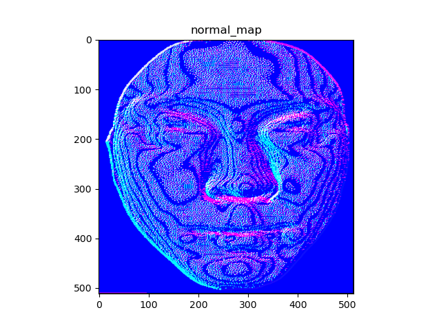

# unsup3d-rep

By Yuseung Lee & Inhee Lee

#### 05/21 Debugging in progress (Yuseung Lee)
* logs stored in /experiments/bfm_train/logs/
* ex) /logs/exp_054144
* Todo: error value is below zero --> needs fixing
```bash
$ python run.py --configs configs/bfm_train_v0.yaml
$ tensorboard --logdir /logs/exp_054144 --port 6001
```

#### 05/16 How to run
```bash
python run.py --configs configs/celeba_train_v0.yaml
```

#### Depth Map to Normal Map
Initial test code at `unsup3d/test_repo/test_normal.py`
```bash
python test_normal.py
```
* Input: depth map

* Output: normal map



